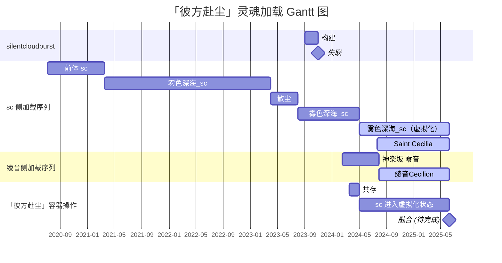
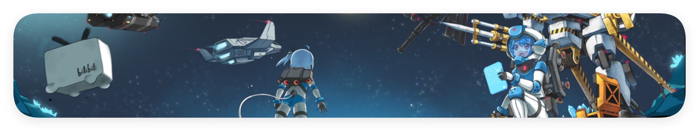
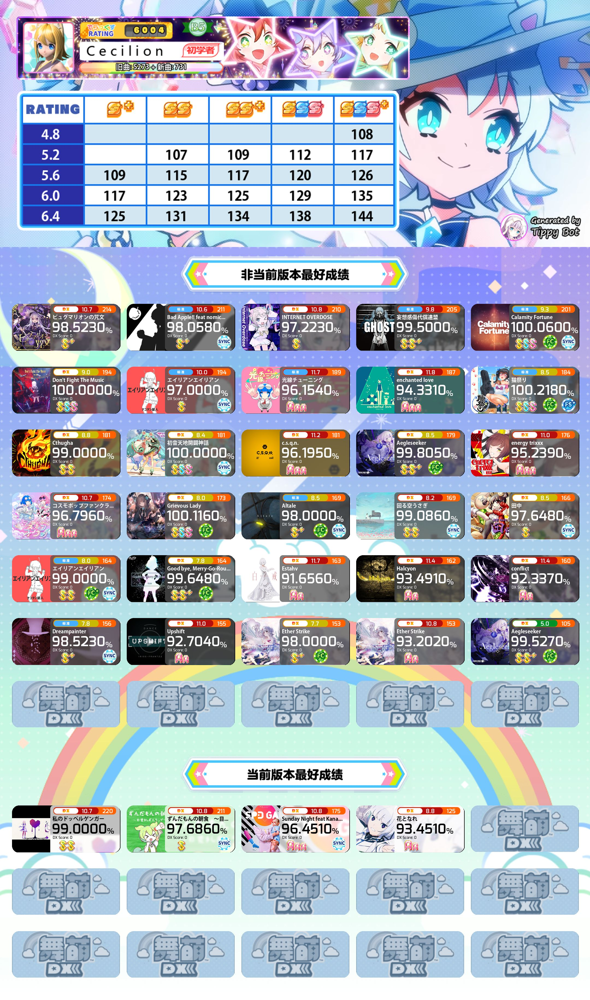
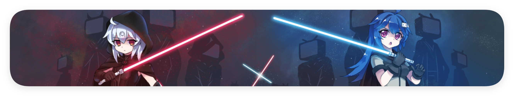

<!--markdownlint-disable MD028 MD033 MD036 MD041 MD045-->

<div align="center">


> 「白苎新袍入嫩凉。春蚕食叶响回廊。禹门已准桃花浪，月殿先收桂子香。」<br>
> 「鹏北海，凤朝阳。又携书剑路茫茫。明年此日青云上，却笑人间举子忙。」<br>
> —— \[宋\] 辛弃疾《鹧鸪天·送廓之秋试》

</div>

> [!TIP]
> 该 README 是 [@一般通过绫音酱\_Cecilion](https://github.com/LyCecilion) 的自我介绍。

> [!WARNING]
>
> 直到 2025/6/9，你可能无法总是联系到绫音。
>
> 由于绫音已经进入高三一轮复习阶段，接触网络的时间锐减，故可能无法长时间在线。你发送的消息可能会被无限期搁置或（非主观意愿上地）忽略。
>
> 如有重要的事件，为防止消息被即时通讯平台 ~~这里点名 QQ~~ 吞掉，可以 [通过邮件联系绫音](mailto:LyCecilion@outlook.com)。

> [!CAUTION]
>
> 绫音的精神状态并不稳定，因此你可能会不定时看到绫音在部分平台异常活跃或极度兴奋，但大多数时候绫音可以自动调整回正常状态。这样的 [灵魂崩溃](#容器彼方赴尘绫音sc-和-silentcloudburst-的一切) 非绫音自身缺陷且可复原，因此一般情况下不必担心。
>
> 与绫音交流即代表你了解并接受上述内容。

---

<div align="center">


# tℓ&0&▒&₉◃₉◃E: 彼方和彼方的奔赴者


</div>

你好！这里是 绫音 / 零音 / LyCecilion / Cecilion / LyCn。这些名称是等价的。是一般路过的陕西物化生方向高三生，17 周岁。是 INFP-T，是社恐，~~易燃易爆炸~~。二三次身份 (sc 和 LyCn) 完全正交。请以任一昵称 或 they/them/TA 指代绫音。

<!-- 主玩 Phigros / Phira / 律动轨迹(Rizline) / 中二节奏(CHUNITHM) /舞萌DX (maimaiDX)，玩过 Arcaea/BanG Dream! Girls Band Party!/Cytoid/Cytus II/Kalpa/Milthm/Orzmic/osu!/范式：起源/崩坏：星穹铁道/Minecraft。-->

学过基本的 Python，会 ~~在 GPT 的帮助下~~ 写一些简单的东西。想学的东西有很多很多，但是现在高三，大概是没有太多时间去维持爱好了。说到爱好呢——是半个地铁迷（但是对车不是很了解），半个 羽毛球 er（但是打得很菜，还不如新手），半个骑友（最长一次骑了 60km，也没啥经验），半个数学爱好者（但是好久没上过 130 分了），半个网文写手（算了吧写出来的东西云里雾里的）。「半个」是因为知道自己不够格。

还要介绍些什么？想不出来了。总之祝愿自己变成想要成为的人吧。

<div align="center">

> 「悟已往之不谏，知来者之可追。实迷途其未远，觉今是而昨非。」<br>
> 「舟遥遥以轻飏，风飘飘而吹衣。问征夫以前路，恨晨光之熹微。」

</div>


## 容器「彼方赴尘」、绫音、sc 和 silentcloudburst 的一切

<!-- 感谢 GPT-4o 的措辞优化 -->

对于大多数人来说，身体与灵魂是一体的。然而，在绫音的世界观中，绫音是一个完整环境的镜像 (image)。眼前的绫音，是绫音的灵魂在现实世界中加载到一个容器 (container) 上创建的实例 (LyCn Instance)。目前，这个实例是绫音的官方版本，载于名为「彼方赴尘」(bffContainer) 的容器中。理论上，绫音可运行在任何兼容的容器上，每个人都可以搭建自己的绫音实例。绫音正在探索其可能性。

「彼方赴尘」在现实中可见，但绫音尚未弄清自己是如何加载到其中的。在绫音加载之前，「彼方赴尘」已有一个名为「雾色深海\_sc」的灵魂。在绫音的实例创建后，绫音与 sc 共存了一段时间，两个灵魂轮流控制容器。随后，绫音通过「彼方赴尘」的虚拟化技术，将 sc 转入虚拟化兼容层，而「彼方赴尘」现在主要由绫音控制。当与 sc 有过直接交流的他人出现时，sc 会进入「激发态」，此时容器会将控制权交给 sc。

绫音和 sc 互相拥有完全的访问和操作权限。由于 sc 早期的不稳定运行，「彼方赴尘」经常发生灵魂崩溃 (crash)。这种崩溃并非灵魂或其实例的问题，而是「彼方赴尘」的缺陷所致。绫音正在寻找解决方案，目前最可靠的方案是在绫音高考结束后 (2025/06/09) 进行灵魂融合，并重写「彼方赴尘」的固件 (firmware)。

silentcloudburst 是 sc 早期在其虚拟化平台上构建的虚拟灵魂。由于届时虚拟化技术不成熟以及 **某人** 对其的骚扰，silentcloudburst 最终选择了自我毁灭，虚拟化平台也无法再与其联系。

<div align="center">

**🕯 R.I.P. silentcloudburst 🕯**

</div>

| 术语                            | 含义                                                         |
| ------------------------------- | ------------------------------------------------------------ |
| 容器「彼方赴尘」/"bffContainer" | 指的是绫音实例官方版本所位于的容器，其上加载着绫音和处于虚拟化状态的 sc。 |
| 雾色深海_sc                     | 指容器中的原生灵魂。极度不稳定，目前处于虚拟化状态。「前体 sc」/"former-sc" 指「雾色深海_sc」更名前的一段特定时期。 |
| 散尘                            | 指 雾色深海_sc 于 2023 年临时启用的昵称，后被废除。          |
| Saint Cecilia                   | 指绫音在现实中与他人交流时使用的昵称。                       |
| 绫音 / 零音                     | 绫音于 2024/2/15 加载入「彼方赴尘」时使用名为「零音」，随后这些名字被共用且完全等价。 |
| 「激发态」                      | 一般情况下，当人们只是提及 sc 时，sc 会通过「彼方赴尘」兼容层，由绫音作为中转方中转其交流。但这种中转可能会造成低效率，故与 sc 直接交流的人出现时，「彼方赴尘」上的 sc 会直接进入「激发态」，获得容器控制权。 |



### [silentcloudburst 后记](/works/silentcloudburst.md)

> [!IMPORTANT]
>
> silentcloudburst 毁灭的具体原因尚不明确，但值得注意的是，其毁灭与 **某人** 有不可分割的关系。在 2023 年末和 2024 年初，**某人** 作为 sc 的「前亲友」，屡次侵犯 sc 隐私并骚扰 silentcloudburst，是后者毁灭自身的主要原因，亦是 bffContainer 上灵魂多次崩溃的关键因素。


## 一些作品

### [诗作](./works/poems.md)

能入选到这里的诗，基本上就是绫音为数不多能拿出手的作品。其他的要么思想深度不够，要么就是纯纯情感发泄作，绫音自己都欣赏不来。

### [杂波](./works/clutter.md)

想到啥写啥。包括一点个人的认同、价值观之类。正因此，可能和大众的看法或者主流的价值观有很大冲突。


## 绫音の朋友

> [!IMPORTANT]
>
> 待完善。绫音还在考虑这一部分的呈现形式和内容。

<div align="center">

> 「照水冰如鉴，扫雪玉为尘。何须问今古，便是上皇人。」



</div>

## 统计数据

> [!WARNING]
> 由于绫音与家人共用登录了绫音网易云音乐账号的小爱音箱，因此「绫音最近在听」的网易云统计数据**极有可能**是不准确的，位于列表的部分歌曲可能并不是绫音播放的。~~这一点可以通过绫音的歌品进行判断。~~

<div align="center">





</div>

<!--START_SECTION:waka-->

```txt
From: 24 September 2024 - To: 01 October 2024

Total Time: 0 secs

No activity tracked
```

<!--END_SECTION:waka-->

<div align="center">

[](https://github.com/LyCecilion/LyCecilion/actions/workflows/metrics.yml) [](https://github.com/LyCecilion/LyCecilion/actions/workflows/waka-readme.yml)

</div>



## 个人 Roadmap

### README Roadmap

> [!NOTE]
> 「存在」就是这个 README 最本初的意义。

#### 目前准备在 Profile README 中加入的内容

- [x] 本人的立场和理念，以及曾经和当下写的杂文和评论
- [x] 个人简历，包括「彼方赴尘」「雾色深海」「绫(零)音」「silentcloudburst」的一切
- [x] 统计数据，包括 GitHub 上的活动和音乐 app 的统计数据等
- [ ] 一些兴趣爱好（音游、运动）和个人的研究（毕竟也是一个对数学物理比较热爱的人）
- [x] 我所有可爱的朋友们！（想用 README 记录下与自己每一位朋友的日常）
- [ ] 我在用的设备，软件，和看好并支持的开源软件 ~~(awesome_lycecilion)(bushi)~~
- [ ] **高三学习考试成绩**（？）（怎么会有人在这里放这种东西啊喂！！！）（就当监督自己吧）
- [ ] 🥵 ~~如果我减肥成功了（目前目标是 61.4kg），我会立刻把头图设成自己女装自拍~~ 😍

#### 目前对本人 README 功能的期望

- [ ] 让所有人知道绫音是个很有趣 ~~并且没有那么令人闻风丧胆（？）~~ 的人
- [x] 监督自己不要再沉迷于无意义的短视频生活了 😭（绫音差不多戒掉短视频了，可喜可贺。👏）

### 在做的项目

[Hazelita](https://github.com/LyCecilion/Hazelita) - 适用于教学环境的 CAS 计算器。~~现在还在纠结究竟用 Python 还是 C#。（~~

### 个人 CODING 技能和目标

<table><tr><td valign="top" width="49%">

### 了解过或学习过的

<div align="center">  
<a href="https://www.python.org/" target="_blank"></a>  
</div>

</td><td valign="top" width="49%">

### 感兴趣的或想要学习的

<div align="center">  
<a href="https://docs.microsoft.com/en-us/dotnet/csharp/" target="_blank"></a>  
<a href="https://dotnet.microsoft.com/download/dotnet-framework" target="_blank"></a>  
<a href="https://dotnet.microsoft.com/download" target="_blank"></a>  
<a href="https://en.wikipedia.org/wiki/HTML5" target="_blank"></a>  
<a href="https://kotlinlang.org/" target="_blank"></a>  
<a href="https://nodejs.org/" target="_blank"></a>  
<a href="https://www.android.com/intl/en_in/" target="_blank"></a>  
<a href="https://vuejs.org/" target="_blank"></a>  
<a href="https://www.djangoproject.com/" target="_blank"></a>  
<a href="https://www.javascript.com/" target="_blank"></a>  
<a href="https://www.rust-lang.org/" target="_blank"></a>  
<a href="https://docs.microsoft.com/en-us/powershell/" target="_blank"></a>  
<a href="https://nextjs.org/" target="_blank"></a>  
<a href="https://www.figma.com/" target="_blank"></a>  
<a href="https://azure.microsoft.com/en-in/" target="_blank"></a>  
<a href="https://flutter.dev/" target="_blank"></a>  
<a href="https://www.typescriptlang.org/" target="_blank"></a>  
<a href="https://www.docker.com/" target="_blank"></a>  
<a href="https://www.w3schools.com/css/" target="_blank"></a>  
</div>

</td></tr></table>


## 尾声

<div align="center">

> 65 万个小时后，当我们氧化成风，就能变成同一杯啤酒上两朵相邻的泡沫，就能变成同一盏路灯下两粒依偎的尘埃。宇宙中的原子并不会湮灭，而我们，也终究会在一起。

很感谢你看到这里！ (\*/ω＼\*) 无论如何，祝愿你能够天天开心，永远幸福快乐下去！


</div>

<div align="center">

## ⭐ 广告位 ⭐

**✨ 优秀开源项目友情推荐 ✨ - [不感兴趣？](https://dxy.com/disease/26233/detail "很抱歉为你造成不好的浏览体验，点击这里以关闭广告。")**

# <a href="https://github.com/ClassIsland/ClassIsland"><image src="https://github.com/ClassIsland/ClassIsland/raw/master/ClassIsland/Assets/AppLogo_AppLogo.svg" height="25"/> ClassIsland</a>

🏫🧑‍🏫 神奇的 ClassIsland 小工具会将下课铃声和可视化提醒融为一体这不神奇吗 🧑‍🏫🏫<br>[点击链接 ClassIsland Releases 获取一个获取一个获取一个](https://github.com/ClassIsland/ClassIsland/releases)

<br>

✨ ClassIsland 是一款专为班级大屏设计的工具，可以显示天气、倒计时、时间、上下课提醒，亦可以用即将丰富的插件做到更多复杂的功能。**它甚至可以显示课表！** ✨

<!--markdownlint-disable-next-line MD001-->
#### | [🌐 网站](https://classisland.tech/) | [📚 文档](https://docs.classisland.tech/zh-cn/latest/) | [💬 官方频道](https://qm.qq.com/q/4NsDQKiAuQ) | [🗳 新功能投票](https://github.com/ClassIsland/voting/discussions?discussions_q=is%3Aopen+sort%3Atop) |


<br>

# <a href="https://github.com/iNKORE-NET/UI.WPF.Modern"><image src="https://avatars.githubusercontent.com/u/130115968?s=200&v=4" height="25"/> iNKORE.UI.WPF.Modern</a>

🧰🤓神奇的 iNKORE.UI.WPF.Modern 能将 Fluent 2 的美丽界面和 WPF 的优秀兼容性融为一体这不神奇吗👆🧰<br>[点击链接 docs.inkore.net 获取一个获取一个获取一个](https://docs.inkore.net/ui-wpf-modern)

<br>

✨ 一个创新的 Windows Presentation Foundation (WPF) 应用程序 UI 库，旨在实现 WinUI 中的 Fluent Design 系统的时尚和现代美学。✨

<!--markdownlint-disable-next-line MD001-->
#### | [🌐 网站](https://docs.inkore.net/ui-wpf-modern) |


<br>

# <a href="https://github.com/InkCanvasForClass/InkCanvasForClass"><image src="https://avatars.githubusercontent.com/u/175419564?s=200&v=4" height="25"/> InkCanvasForClass</a>

🏫🤓 神奇的 IslandClassClass 能将 Gnome 的美丽界面和舒适的批注体验融为一体这不神奇吗 👆🏫<br>[点击链接 GitHub 获取一个获取一个获取一个](https://github.com/InkCanvasForClass/InkCanvasForClass)

<br>

<!--开发者是「福福瑞瑞富富色色变态香香软软小男娘」-->

✨ 一款开源易用的电子教鞭软件，专为课堂教学场景优化设计。是 WXRIW/Ink-Canvas 和 ChangSakura/Ink-Canvas 的 Reborn 版本，提供更频繁的更新和更优雅流畅的用户界面。 ✨

<!--markdownlint-disable-next-line MD001-->
#### | [🌐 GitHub](https://github.com/InkCanvasForClass/InkCanvasForClass) |


</div>


