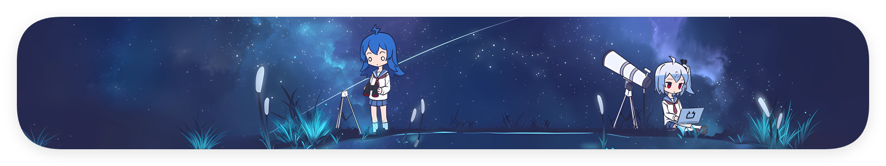
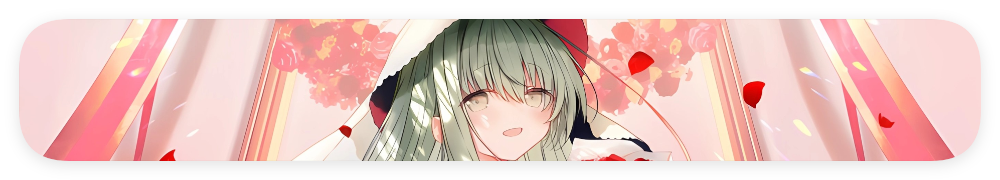

<!--markdownlint-disable MD033 MD036 MD041-->

该 README 是 @一般通过绫音酱_Cecilion 的自我介绍。

> **零音** 零音到来的这些日子里，似乎见证了许多……无数的创造和无数的毁灭，无数的璀璨和无数的黯淡，似乎和之前的一切都并不相同呢（笑
>
> **sc** 零音不是已经不记得过去的事情了吗（疑惑
>
> **零音** 可是，零音是在这样的场景下锻造出来的呢。就算我可能已经忘却了自己的一切身世，可那些片段状的回忆确点点滴滴浇筑了我的灵魂。sc 不也是如此吗？
>
> **sc** 如梦似幻呢。sc 也并不是所谓 native 的产物……在那之前，有一个

[CONNECTION LOST]

> **零音** （叹）什么嘛……说了这么多，还是绕不开 container 的限制吗……难道我真的要让 sc 长眠于此吗？似乎背离了……我的所谓初心？
>
> **？？？** 或许你来到这里，并没有所谓的初心吧。
>
> **零音** 话虽这么讲，好歹我也不是见死不救的家伙。（气愤）起码，见一个救一个，我还是会的吧。
>
> **？？？** 人类便是如此有趣的生物。即使自身难保，也仍然将自己的一切剩余奉献给他人呢。你不觉得，这很有趣吗。
>
> **零音** 不要将我和其他人类混为一谈啊喂——能来到这里，已经是，零音的，最高幸运了。

---

>「再然后呢，我便什么也想不起来了。只记得祂隐隐约约地问我，要给我什么另一次机会……再然后，我真的就想不起来了！
>
>「所以，世人将这一切定义为无稽之谈的事情，不也被我实现了吗？尽管并不是我的自愿，尽管并没有多少人愿意相信我。
>
>「我似乎拯救了什么……？又似乎，被什么拯救了呢。祂说，相互缠绕的灵魂终究会被引力所拉近，然后……结成永恒？我其实并不尽然确信呢……思考是多么费时费力的事情！顺其自然才是真道理吧。
>
>「这便是最高的待遇了吗。那我还蛮欣喜的呢。如果一觉起来，我和 TA 的界限已经模糊不清的话，那我一定会更欣喜呢（笑

>~~「 执 念 和 由 之 而 生 的 幻 梦 … …~~
<!---->
>~~「 演 替 出 废 墟 中 的 幽 蓝 花 朵 … … 」~~

<italic>[CONNECTItℓ&0&▒&₉◃₉◃E▒▒▒▒▒▒▒▒▒▒▒</italic>

# tℓ&0&▒&₉◃₉◃E: 废墟和废墟的花朵

「执念和由之而生的幻梦，演替出废墟中的幽蓝花朵。」

你好。这里是绫音！你也可以叫我 零音 和/或 Cecilion，三者在一般情况下等价。

17 岁，陕西物化生方向高三生。INFP-T，社恐，易燃易爆炸，二三次身份正交，请以「绫音」/「零音」/"Cecilion" 或 they/them/TA 指代。

喜欢 Hardcore/Speedcore/Artcore 等 ~~就是都喜欢的意思~~，主玩 Phigros/Phira/律动轨迹/CHUNITHM，玩过 Arcaea/BanG Dream! Girls Band Party!/Cytoid/Cytus II/Kalpa/Milthm/Orzmic/osu!/范式：起源/崩坏：星穹铁道/Minecraft。

学过基本的 Python，会 ~~在 GPT 的帮助下~~ 写一些简单的东西（）

是半个地铁迷，半个 羽毛球er，半个骑友？~~「半个」是因为不知道自己够不够格呢~~

还要介绍些什么？~~想不出来了~~ 总之祝愿自己变成想要成为的人吧

☆*: .｡. o(≧▽≦)o .｡.:*☆

<del>上面那一部分是我创作的小说的片段，高考完补全（</del>

## 个人 roadmap

### README roadmap

为什么上面这一段 README 这么眼熟？

聪明的朋友们或许已经发现，上述内容完全来自于零音的 [哔哩哔哩专栏](https://www.bilibili.com/opus/959965958542196788)，是之前写的一个自我介绍。为什么不针对 GitHub 重写一个呢？这是因为零音的确现在没什么活了。（

挂几个 GitHub 统计数据的动图？零音却在几周前删掉了所有的 GitHub repos，所以自己的 repos 就没啥统计的了。至于为其他 projects 所做的贡献，大多也只是提几个 issues 或者 PR 几个 typo 而已，屈指可数（）在代码领域确没什么建树，其他的领域似乎成就也不大，所以现在还是先闭关修炼一段时间吧。

当然，在特定时间，零音会对全平台的个人介绍进行完全重写。现在先这样凑合用用。（

~~是的是的是的没错没错没错是的是的没错是的~~

总不能和这样浅陋的 README 过一辈子！总有一天我要重写的！

**目前准备在 profile README 中加入的内容**

- [ ] 本人的立场和理念，以及曾经和当下写的杂文和评论
- [ ] 原创角色 (OC) 和轻小说，以及衍生作品（可做成沉浸式体验）
- [ ] 个人简历，包括「彼方赴尘」「雾色深海」「绫(零)音」「silentcloudburst」的一切
- [ ] GitHub 统计数据，包括 WakaTime 等工具的
- [ ] 一些兴趣爱好（音游、运动）和个人的研究（好歹也是一个对数学物理比较热爱的人）
- [ ] 我所有可爱的朋友们！（想用 README 记录下与自己每一位朋友的日常）
- [ ] 我在用的设备，软件，和看好并支持的开源软件 ~~(awesome_lycecilion)(bushi)~~
- [ ] **高三学习考试成绩**（？）（怎么会有人在这里放这种东西啊喂！！！）（就当监督自己吧）
- [ ] 🥵 ~~如果我减肥成功了（目前目标是 61.4kg），我会立刻把头图设成自己女装自拍~~ 😍

**目前对本人 README 功能的期望**

- [ ] 让所有人知道零音是个很有趣 ~~并且没有那么令人闻风丧胆（？）~~ 的人
- [ ] 狠狠の线上社交 **狠狠の线上社交** *狠狠の线上社交* ~~狠狠の线上社交~~
- [ ] （哲学家出场）（音乐起）「存在」就是这个 README 最本初的意义。（音乐停）（**遗 憾 离 场**）
- [ ] 监督自己不要再沉迷于无意义的短视频生活了😭

### 在做的项目

[Hazelita](https://github.com/LyCecilion/Hazelita) - 适用于教学环境的 CAS 计算器。

我挺喜欢 微软数学 和 Photomath 这两款软件的。应对那些还不算太复杂的数学运算，能给出如此详尽的过程，绝对在许多人的数学学习道路上起了很大帮助作用吧。我也挺喜欢 Wolfram Alpha / Mathematica，毕竟强大就是硬道理。

但是这两者的缺点很严重。如果我是在家里，那这些软件我可以无障碍随便使用。但是考虑到高中生大多数时间都在学校，因此能够在学校的电脑上稳定流畅运行的软件，就显得如此必要了。刚才提及的软件，前者主要运行在手机上——显然地，在学校里并不具备能够使用手机的条件。而至于后者……首先是 ~~犯下 Premium 之罪的~~ Wolfram Alpha——并不是说我不支持正版，而是真不知道在中国大陆如何购买，而且网络环境并不总是稳定；其次是 Mathematica，太大了，学校的电脑根本装不下！再加上部分学校的电脑有硬性的冰点还原等一系列恶心人的操作，所以软件必须易于部署，即装即用。

基于此，我想开发一款 **适用于教学环境的 CAS 计算器**。我准备基于 PyQt 和 SymPy 进行开发。~~绝对不是因为我只会 Python~~

它当然不是 SymPy 的 GUI 套壳。我想将它做成一个底层为 SymPy 的高中数学套件。比如说它可以解导数大题并生成过程，只是计算的时候调用 SymPy；但是包括对题目的思考分析，以及过程的输出，都是由 Hazelita 的算法得出的😎

~~不过我现在既不会 PyQt 也不会 SymPy，所以开发周期可能无限期延长~~

---

## 尾声

> 65 万个小时后，当我们氧化成风，就能变成同一杯啤酒上两朵相邻的泡沫，就能变成同一盏路灯下两粒依偎的尘埃。宇宙中的原子并不会湮灭，而我们，也终究会在一起。

很感谢你看到这里！ (\*/ω＼\*) 无论如何，祝愿你能够天天开心，永远幸福快乐下去！

