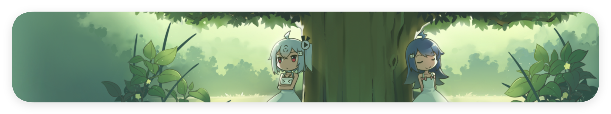

# 杂波

> [!NOTE]
> 想到啥写啥。包括一点个人的认同、价值观之类。正因此，可能和大众的看法或者主流的价值观有很大冲突。

<!--markdownlint-disable-next-line MD026-->
## 混沌的思考——尊重他人命运，放下助人情节。

> [!IMPORTANT]
> 2024 年 8 月 14 日创作，发布于 知乎、哔哩哔哩、小红书和绫音的 QQ 空间。

我一直想对世界上所有的群体保持客观的评价。这也是我一直对其他人很难接受、甚至很难评价的群体保持极高包容性的原因。

我有时会惊异于其他人，因为一部分人的逆天行为而反感整个群体的行为。没错，在我看来这的确是有失公允的——毕竟有些人很可能只是先天的「杂种」，只是这随机的样本恰好落入到这个群体而已。我为其他人的这种行为感到惊异和愤怒。

不过，后来我也淡然了。

毕竟，五年了——我尝试以客观的态度去评价、去包容、去接纳一切，去用自己的善良尝试改变他人。我直视血图和刀痕，忍着生理上的不适，在工作日的夜晚熬夜为其他人做心理工作，然后在第二天的学校用咖啡勉强维持生理体征。我在 B 站评论区里面对着弱智的小学生问题，也认真地、尊敬地打出长长的回复。我面对别人的一切怀疑和否定，恭恭敬敬地答复，企图「用事实说话」。无论与我的观点多么冲突的言论，我都会至少「理解并尊重」。而甚至是对于那些我刚开始无法接受的群体，我会主动置身其中，试图遵循「换位思考」「将心比心」的箴言——我当过「追星族」，在社交平台挂过 LGBT 旗，也曾经深入过职校人的内心。面对他人的苦难，我真正束手无策时候，也尽量为其他人提供心理慰藉。是的，放在小说和番剧里，我就是「赛博天使」一般的存在。

有些时候我内心中也会有一种欲望产生。我想睡觉，我想抽身而退，我想变得自私。有些时候遇到过于逆天的人——中考 200 分在家里啃老的人，我在眼前的小屏幕上飞快地敲击，与此同时，内心中的一个声音响起了：「他们根本不配被拯救吧！」但我压抑住这样的想法，「可恨之人亦有可怜之处」，我默念着。

但结果是什么？诚然，我救过人，也的确有人没救回来过——一心赴死的人，我并无法挽回。我被人感谢过，也和一些上述的人成为了朋友。但更多的是什么？是进一步的质疑和无脑的否定。当我从一个救赎抑郁症的灵魂变成一个抑郁症的撒气筒的时候；当我被其他人进一步攻击，每一句话都成为靶点的时候；当我的自证清白成为了他人眼中刻意的举动，成为了「负隅顽抗」的时候；当别人听不懂我的回答，指责我「浪费时间」的时候……我在想，我自己所坚守的所谓「客观」和「正义」，究竟是不是它最原初的样子？又或者，它究竟在当下行得通吗。

暑假我阅番无数，又为人与人之间的善良和真诚而感化，拼尽全力想要成为一个善良和真诚的人。然而关掉番剧，打开社交软件——杂言碎语、乌烟瘴气，伴着八月西安的第一场大雨侵袭我的内心：音游曲的评论区，重大事件的群内聊天——无数人如无头苍蝇一般再次冲入一种「混战」，在这场战役中肆意挥霍着自己的「言论自由」，将一切相不相关的恶水喷洒在所有对立的人的头上。

让我在这种纷杂的环境中保持「客观」和「正义」，无异于让我在被困十天解救后的第一顿饭上保持繁琐的餐桌礼仪。做不到。真的做不到。

「真诚」是必杀技？我笑了，笑了很久；直到笑了之后我突然回头，好似违背了什么内心的禁忌一样。或许「真诚」「客观」「正义」「理性」之类的字眼并没有什么先天的问题，就正如同过去每个历史时代都有在当时被认为是「正确」的观念一样——只是适不适用的问题。互联网繁杂到难以想象，「地球村」的确不再是设想；社交平台降低了人们的交流门槛，但，「at what cost」？

不过，后来我也淡然了。

「客观」是什么？是所有人「主观」的集合体吗？我或许连这个问题也回答不了。我只是想遵循一种我自认为的正义，一种尽量不让身旁人受伤的正义。但我体谅别人的时候，谁来体谅我呢？回顾过去一段段历史，我细细复盘着。「为何一个严重的精神疾病患者还能给其他人提供精神价值，在自己绝望的时刻也不放弃对他人施以援手？」我赞叹过去的自己，直到意识到那是我自己。

我也被人拯救过，我知道那是什么样的感受。我保持着对等的敬意，对每一位曾经拯救过我的朋友保持至高的敬意。但似乎并不是所有被拯救的人都有如同我的思想觉悟，我也并不清楚我的思想觉悟是否有点高得过度。我效仿他们的行为去拯救其他人——在其他人的身上，我看到了我的阴暗，却似乎始终没有看到他们内心里唯存的光明。

「他们根本不配被拯救吧……」

内心里的一个声音又响起。

只是这次，我不再压抑我的内心。

善良的我，为那么多灵魂提供了至高的关切；唯独没有惠及的，原来只有我自己。

嗯。现在的我仍然讨厌那些极端自私的人，也未更改过我的「客观」「正义」的想法，亦会尽力去理解和尊重每一个人。但这一切，现在都要以「对方尊重我」为基本的前提条件。

我掌握了一门曾经我认为只有小学生会用的技能——遇到无端辱骂和倾泻废水的人，举报和拉黑。说实话，这两个按钮真是有用。

我仍然尝试拯救一些精神障碍的网友，但我只拯救我认为有价值的人。

「我是不是有一些自私自利了？」过去的自己如此质问我。

「并不，」我摇了摇头。「我只是在关怀他人的同时，不忘记关怀了自我。」

## 当我成为 地球OL 的 NPC

> [!IMPORTANT]
> 2024 年 2 月 26 日创作。仅发布于个人博客（博客待重修）。

如果说一个人的生命就像一场游戏一样，那么那些什么都干，过得轰轰烈烈的人生就是玩家体验完整 DLC 的一次存档。

局限地从一方面来看，如果我只是游戏中毫无存在感的 NPC 或者是主角，那么我在每天生活中每一分每一秒的鲜活的经历，或许只是游戏屏幕上一个沉默的数字而已。我的一些快乐只会增加某个数值，而我的一切悲痛也依然是一个数值。

在这样的思想困境中，我逐渐在陷入迷茫。至少尽管我的一言一行对于这个世界，或者说，对于我身边的人来说似乎真的没有太大的影响——但是它们对于我的感受的影响是客观存在的。

我向来不是一个追逐鸡汤的人，但是我的确是一个白日做梦的能手，也是一个完全的理想主义者。这两周里，我在处于无时无刻的焦虑之中，也在许多时刻对自己每一秒的行为都产生大量的怀疑。痛苦和迷茫是不变的。

所以，既然我的一切都只是一些毫无意义的数字，就好比我的十二年在他人的眼里只是一个三位数，那我似乎……并没有什么真正值得更害怕的事情了。

人生可能没有意义，但意义必须有人生。既然如此，他人对我的追求，或者现实这款游戏对我的追求如果只是一个简单的三位数，那我只要能够到这个三位数就够了。所有的师生关系又或者是学校实践似乎并没有多重要——反正人们评价一个高中生，最多看的也就是那不起眼的三位数吧。那我就似乎更加无所畏惧了。

反正结局都是一样的，为什么不能把自己的生命过得更轰轰烈烈呢？

悲观主义者眼里的桎梏，似乎在我这里逐渐变成了更加有意义的挑战。无论是身体上的先天缺陷，还是家庭危机，又或者是心理上的问题，似乎只能也只配是一个游戏存档里刚开始设置的难度罢了。存档可以有很多个，而这游戏的操作者也从来不会意识到某一个存档里人真正的死活，就像我终究不是活在别人的聚光灯下一样。那我就更加无所畏惧了。

我逐渐独立于某一个残存的躯干之上，让我的意识脱离了物质上的存在，脱离荷尔蒙的限制，真正成为了这个游戏的操作者的一部分。现在再去看这个世界，我的每一个脚步或者说每一段动作，都只是游戏中一个简单的过场动画而已。

那我就更加无所畏惧了。反正只是游戏而已——在高维的思考中竭尽所能填满每一个数值，在低维的行动中活出自己。不需要情感，不存在疼痛，有梦的地方就有可能。不再让所谓短视的眼光指点我的一举一动——

上天为我封上枷锁，我依然向阳而歌。
